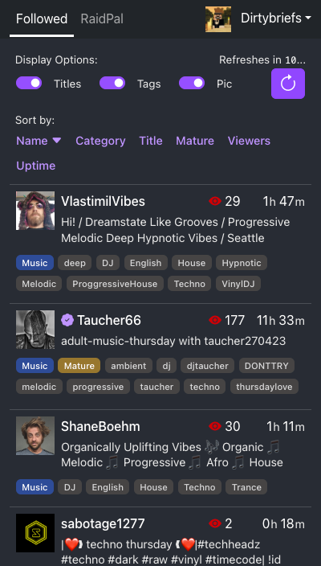
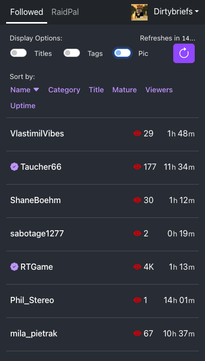
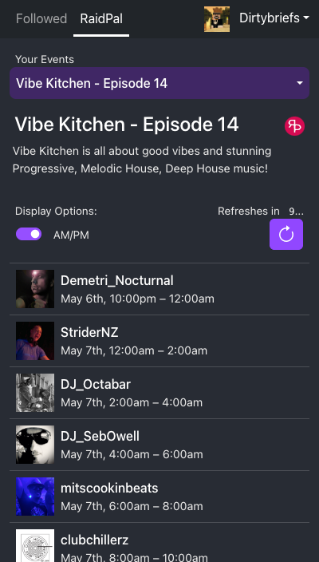
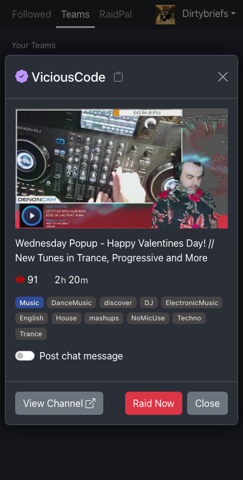
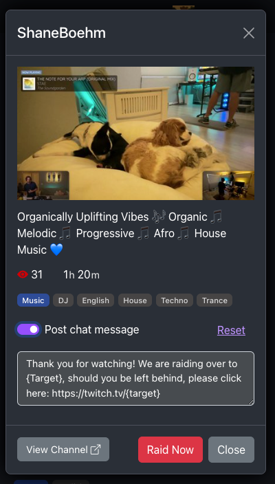
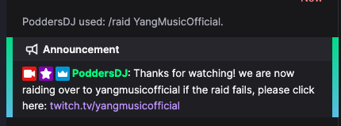
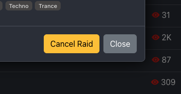

# Dirty Raid Target Finder

Twitch raid target finder. Usable as an OBS browser dock to make finding a raid target
quick and painless. Raid out right from the app, never typo someone's channel name again! 
Works great from a phone or tablet too! 

Features:
- **Client-side app** – Your personal data is never stored or transmitted anywhere but your own computer. Privacy™
- **OBS Dock** – Add this app as a custom browser dock to have a seamless stream experience.
- **No Typos** – Never worry about a channel name typo again, just click the big red button to raid!
- **Real Time** – The app refreshes automatically (every 15s) so you'll always have the latest status.
- **Sorting** – Sort your followed channels by name, viewer count, uptime and more!
- **[RaidPal](https://raidpal.com/) integration** – See how many raiders are arriving, check your raid target is online, uptime and more!
- **Twitch Teams integration** – See all live twitch team members from any team you are a member of.
- **Raid Roulette** – Can't decide who to raid? no problem, let Dirty Raid Target Finder pick a target for you.
- **Raid Announcements** – Post an announcement in chat when you start a raid to let any failed raiders know where you are going.

## Screenshots

By default, stream title, tags and profile pics are visible, click the raid roulette option to choose a random raid target:

Optionally, turn off the info to get a condensed list:

If you are a member of a twitch team, click the teams tab to see any live team members:

Click the [RaidPal](https://raidpal.com/) tab to view any [RaidPal](https://raidpal.com/) raid trains you may be a part of:

Select a channel to see the stream info and push the big red button to start the raid!

Click the post chat message option to customise and post a raid message in your chat for those that may miss the raid:

After starting the raid, you can cancel for up to 90 seconds or until the raid is executed from the Twitch UX.

> Note: The Twitch API limits you to no more than 10 raids in a 10-minute window. Be decisive with your raids!

## Add to OBS

Add the app as a custom dock to OBS:
- From the menu, select `Docks` > `Custom Browser Docks...`
- Enter a name for the dock (e.g. `DirtyRaid`) and the url: `https://raid.dirtybriefs.net`
- Click `Apply` - the Dock should now appear, likely behind the Custom Browser Docks dialog.
- Move the dock to where ever you'd like, docking it to OBS or keep it detached for a separate monitor.

# Contributing

Have some ideas, feedback, or want to add some features? Hit me up on Discord, open an issue, or fire a PR this way!

# Toolchain

This project was bootstrapped with [Create React App](https://github.com/facebook/create-react-app).

## Available Scripts

In the project directory, you can run:

### `npm start`

Runs the app in the development mode.\
Open [http://localhost:3000](http://localhost:3000) to view it in your browser.

The page will reload when you make changes.\
You may also see any lint errors in the console.

### `npm test`

Launches the test runner in the interactive watch mode.\
See the section about [running tests](https://facebook.github.io/create-react-app/docs/running-tests) for more information.

### `npm run build`

Builds the app for production to the `build` folder.\
It correctly bundles React in production mode and optimizes the build for the best performance.

The build is minified and the filenames include the hashes.\
Your app is ready to be deployed!

See the section about [deployment](https://facebook.github.io/create-react-app/docs/deployment) for more information.

### `npm run eject`

**Note: this is a one-way operation. Once you `eject`, you can't go back!**

If you aren't satisfied with the build tool and configuration choices, you can `eject` at any time. This command will remove the single build dependency from your project.

Instead, it will copy all the configuration files and the transitive dependencies (webpack, Babel, ESLint, etc) right into your project so you have full control over them. All of the commands except `eject` will still work, but they will point to the copied scripts so you can tweak them. At this point you're on your own.

You don't have to ever use `eject`. The curated feature set is suitable for small and middle deployments, and you shouldn't feel obligated to use this feature. However we understand that this tool wouldn't be useful if you couldn't customize it when you are ready for it.

## Learn More

You can learn more in the [Create React App documentation](https://facebook.github.io/create-react-app/docs/getting-started).

To learn React, check out the [React documentation](https://reactjs.org/).

### Code Splitting

This section has moved here: [https://facebook.github.io/create-react-app/docs/code-splitting](https://facebook.github.io/create-react-app/docs/code-splitting)

### Analyzing the Bundle Size

This section has moved here: [https://facebook.github.io/create-react-app/docs/analyzing-the-bundle-size](https://facebook.github.io/create-react-app/docs/analyzing-the-bundle-size)

### Making a Progressive Web App

This section has moved here: [https://facebook.github.io/create-react-app/docs/making-a-progressive-web-app](https://facebook.github.io/create-react-app/docs/making-a-progressive-web-app)

### Advanced Configuration

This section has moved here: [https://facebook.github.io/create-react-app/docs/advanced-configuration](https://facebook.github.io/create-react-app/docs/advanced-configuration)

### Deployment

This section has moved here: [https://facebook.github.io/create-react-app/docs/deployment](https://facebook.github.io/create-react-app/docs/deployment)

### `npm run build` fails to minify

This section has moved here: [https://facebook.github.io/create-react-app/docs/troubleshooting#npm-run-build-fails-to-minify](https://facebook.github.io/create-react-app/docs/troubleshooting#npm-run-build-fails-to-minify)
